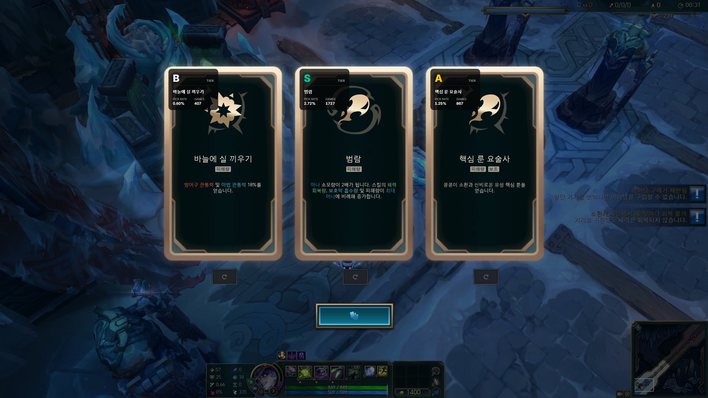

# ARAM Mayhem Advisor

리그 오브 레전드 무작위 총력전: 아수라장 모드에서 증강 선택을 도와주는 오버레이 도구입니다.

## 주요 기능

- 실시간 증강 티어 정보 표시
- 챔피언별 증강 추천
- 픽률 및 게임 수 정보 제공
- 시스템 트레이에서 실행

## 작동 방식

OCR(광학 문자 인식)을 사용하여 현재 화면에서 증강 카드의 텍스트를 인식합니다. 인식된 증강 이름을 데이터베이스와 매칭하여 해당 챔피언에 대한 티어 정보를 오버레이로 표시합니다.

## 다운로드

[Releases](../../releases) 에서 최신 버전을 다운로드하세요.

## 사용 방법

1. 프로그램 실행
2. 리그 오브 레전드에서 무작위 총력전: 아수라장 게임 시작
3. 증강 선택 화면이 나타나면 자동으로 티어 정보가 오버레이로 표시됨
4. 종료하려면 시스템 트레이 아이콘 우클릭 → 종료

## 요구 사항

- Windows 10/11
- Microsoft Edge WebView2 Runtime

## 참고 사항

- 현재 QHD(2560x1440) 환경에서만 테스트되었습니다.
- 라이엇에서 아수라장 모드 관련 API를 제공하지 않아 증강 추천 데이터의 정확도가 낮을 수 있습니다.

## 알려진 이슈

- 증강 텍스트 영역에 증강 이름과 비슷한 텍스트가 표시될 경우 오버레이가 잘못 표시될 수 있습니다.
